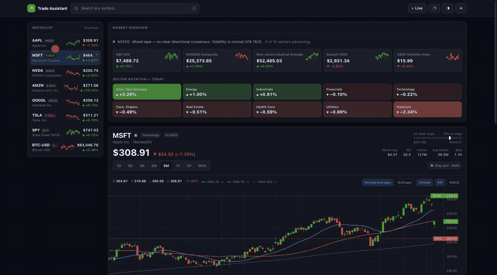
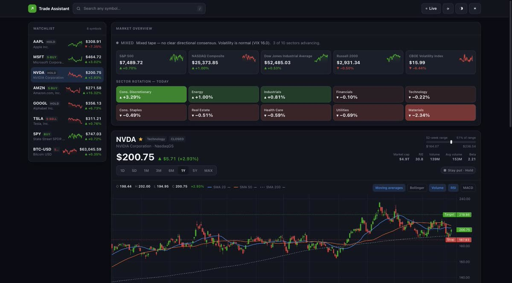
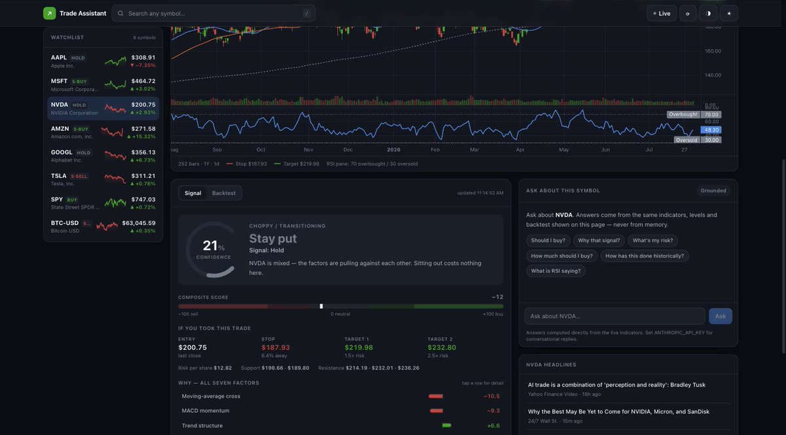
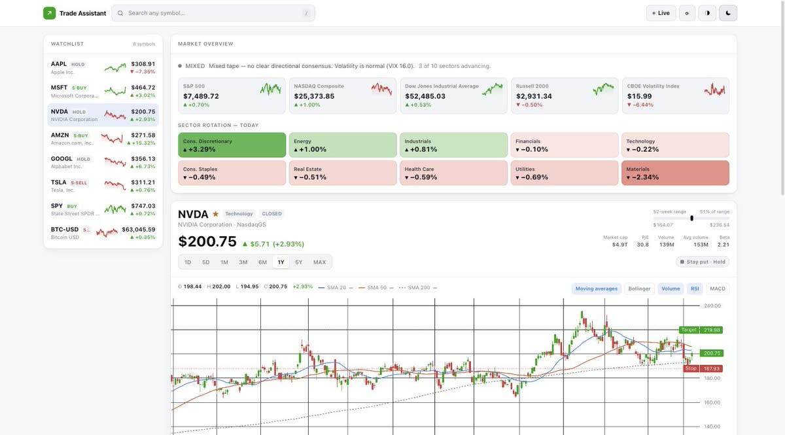

<div align="center">


# AI Trade Assistant

**When money goes in. When it comes out.**

Seven technical factors, scored and explained — then backtested against buy-and-hold
so you can see whether the logic ever actually worked.

[](https://github.com/Isaiahchonchoramirez/ai-trade-assistant/releases/latest)
[](https://isaiahchonchoramirez.github.io/isaiahramirezdev/trade-assistant/)

<sub>Python 3.10+ · no API keys · no account · MIT</sub>

<br>



</div>

---

## Get it running

**Download and double-click.** No build step, no Node, no configuration.

<div align="center">

### [⬇ Download v1.0.0 (180 KB)](https://github.com/Isaiahchonchoramirez/ai-trade-assistant/releases/latest)

</div>

| Platform | What to do |
|---|---|
| **macOS** | Unzip → double-click `Start Trade Assistant.command`<br><sub>If macOS blocks it: right-click → Open → Open.</sub> |
| **Windows** | Unzip → double-click `start.bat` |
| **Linux** | Unzip → `./start.sh` |

First run takes about a minute while it builds its own environment. After that it
starts in a couple of seconds and opens your browser automatically. You need
[Python 3.10+](https://www.python.org/downloads/) and an internet connection —
nothing else.

<details>
<summary><b>Or run from source</b></summary>

```bash
git clone https://github.com/Isaiahchonchoramirez/ai-trade-assistant.git
cd ai-trade-assistant
python3 run.py          # does everything: venv, deps, server, browser
```

For frontend development with hot reload, run the two halves separately:

```bash
# terminal 1 — API on :8000
cd Backend && ../.venv/bin/uvicorn app.main:app --reload --port 8000

# terminal 2 — Vite on :5173, proxying /api to the backend
cd Frontend && npm install && npm run dev
```

</details>

---

## What it actually does



### The signal

Seven factors each read the tape independently, scoring −1 (bearish) to +1 (bullish),
then combine by weight into one number from −100 to +100:

| Factor | Weight | Reads |
|---|---:|---|
| Trend structure | 22 | Price against the 50- and 200-period averages, and whether the 50 is over the 200 |
| MACD momentum | 16 | Histogram size, and whether it is expanding |
| Moving-average cross | 14 | Gap between the 12- and 26-period EMAs |
| RSI | 14 | Momentum, faded back at genuine extremes |
| Trend strength (ADX) | 12 | Directional-movement gap, scaled by how trending the tape is |
| Volume & money flow | 12 | Whether volume confirms the move |
| Bollinger position | 10 | Mean reversion — the brake that stops the score chasing an extended move |

That maps to an action — **≥ +45** strong buy, **≥ +18** buy, **≤ −18** sell,
**≤ −45** strong sell — with an entry, a protective stop 1.8 ATR away, and targets at
1.5× and 2.5× the resulting risk.

**Every factor shows its own contribution and a plain-English reason.** Nothing is a
black box, and the panel leads with the verb — *Money in*, *Money out*, *Stay put* —
rather than jargon.



### The backtest

The same scoring code is replayed bar by bar over history. Two rules keep it honest:

1. **No lookahead.** A signal computed from bar *i*'s close is acted on at bar *i+1*'s
   open — you could not have traded a close you hadn't seen.
2. **Costs are real.** Every fill pays 5 bps of commission and slippage, and a 2.5 ATR
   stop is checked against the bar's low. A gap below the stop fills at the *open*, not
   at the stop, because the market never traded there.

Results sit next to buy-and-hold on return, drawdown, Sharpe and time invested, with a
✓ on whichever side wins each measure. **On most large caps buy-and-hold wins on raw
return and the strategy wins on drawdown** — the app shows that rather than hiding it,
and grades its own evidence: under ten round trips it tells you the sample can't
separate an edge from luck.

### The assistant

Ask in plain language — *why that signal?*, *what's my risk?*, *how much should I buy?*
Answers are computed from the same indicator values on screen, so it **cannot invent a
number**. No API key needed. Set `ANTHROPIC_API_KEY` and open-ended questions route
through Claude instead, grounded on the same data.

---

## Design notes



**Colour is never the only signal.** The green-up/red-down convention every trader reads
instinctively fails a colourblind check badly — measured separation between `#0ca30c`
and `#d03b3b` is ΔE 4.1 under deuteranopia, where 8 is the floor. Rather than abandon
the convention, every value also carries a sign, an arrow glyph and a text label, and
the ◑ toggle swaps both poles for a blue/orange pair measuring ΔE 24.7 (light) and 26.8
(dark). The strategy-vs-benchmark series use that same validated pair.

**Scales adapt to the data.** Price chart and equity curve both switch to logarithmic
once the span demands it — 8× for price, 20× for portfolio value. Across 45 years of
AAPL a linear axis flattens the first three decades onto the baseline; on a log axis
equal percentage moves look equal, which is what compounding actually means.

**Keyboard first.** `/` focuses search, `1`–`8` switch range, `★` toggles the watchlist.

---

## How it fits together

```
run.py                    One command: venv, deps, server, browser
Backend/
  app/
    main.py               FastAPI — also serves the built UI when present
    services/
      market.py           yfinance access, TTL cache, range specs, search, news
      indicators.py       Indicator maths — every function is causal
      signals.py          The seven factors, composite, levels, explanations
      backtest.py         Bar-by-bar replay with costs and stops
      assistant.py        Grounded responder + optional Claude
    api/v1/routes.py      HTTP surface
  snapshot_demo.py        Freezes the API to JSON for the static demo
Frontend/src/
  index.css               Design tokens — the validated palette lives here
  components/             Chart, signal, backtest, watchlist, assistant
scripts/package_release.sh  Builds the downloadable zip
```

Route handlers are `def`, not `async def`, on purpose: each ends in a blocking
`yfinance` call, so FastAPI runs them in its threadpool where they can't stall the event
loop. Batched endpoints fan out across a thread pool on top of that.

<details>
<summary><b>API reference</b></summary>

| Endpoint | Purpose |
|---|---|
| `GET /api/v1/meta` | Ranges, factor weights, assistant status, disclaimer |
| `GET /api/v1/search?q=` | Symbol lookup |
| `GET /api/v1/quote/{symbol}` | Last price, day move, company facts |
| `GET /api/v1/analysis/{symbol}?range=&capital=` | Candles, overlays, oscillators, signal, backtest |
| `GET /api/v1/history/{symbol}?range=` | Candles only |
| `GET /api/v1/market/overview` | Indices, sector rotation, breadth |
| `GET /api/v1/watchlist?symbols=` | Batched quotes, mini signals, sparklines |
| `GET /api/v1/news/{symbol}` | Recent headlines |
| `POST /api/v1/chat` | Ask the assistant about a symbol |

Interactive docs at `/docs` while running. Config via `CORS_ORIGINS`, `INDEX_SYMBOLS`,
`SECTOR_SYMBOLS`, `DEFAULT_WATCHLIST`, `MAX_WORKERS`, `STATIC_DIR`, `ANTHROPIC_API_KEY`.

</details>

Search covers equities, ETFs, indices (`^GSPC`), crypto (`BTC-USD`), FX (`EURUSD=X`)
and futures (`GC=F`) — anything Yahoo Finance resolves.

---

## Limitations

- **Prices are delayed.** Yahoo Finance is free and not a real-time feed. Don't trade
  off the last tick shown here.
- **Long-only.** A sell signal means *exit*, not *go short*.
- **Single-symbol, unlevered**, no dividends beyond what the adjusted close includes, no
  taxes, no sizing beyond all-in/all-out.
- **A backtest always flatters itself.** It never misses a fill, panics, or changes its
  mind.
- **Few trades.** A trend-following overlay makes a handful of round trips a year, so on
  most ranges the sample is too small to prove anything. The app labels this.

## Disclaimer

Educational technical analysis, **not financial advice**. These signals describe what
indicators say about past price action. They do not predict the future, and no backtest
result implies a future one. Never risk money you cannot afford to lose.

## Licence

MIT — see [LICENSE](LICENSE).
